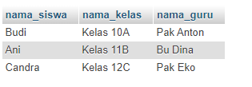
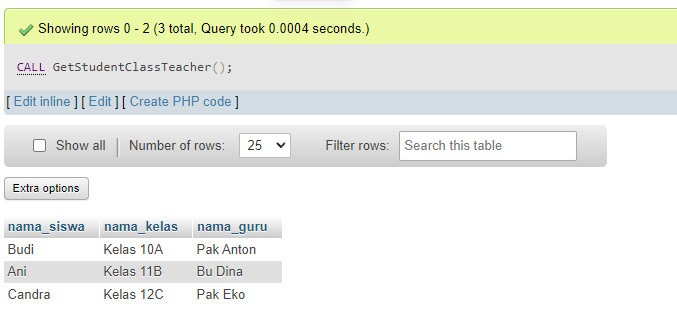
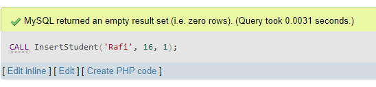
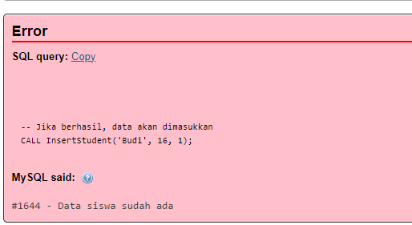

## Dokumentasi Query SQL

### 1. Pembuatan Database dan Tabel

Pertama, script ini akan membuat database baru bernama `tes_seru` jika belum ada. Kemudian, tiga tabel dibuat untuk menyimpan informasi tentang entitas utama dalam sistem:

* **Tabel `teachers`**:
    * `id`: ID unik untuk setiap guru (integer, auto increment).
    * `name`: Nama lengkap guru (varchar, maksimal 100 karakter).
    * `subject`: Mata pelajaran yang diajarkan oleh guru (varchar, maksimal 50 karakter).
* **Tabel `classes`**:
    * `id`: ID unik untuk setiap kelas (integer, auto increment).
    * `name`: Nama kelas (varchar, maksimal 50 karakter).
    * `teacher_id`: ID guru yang mengajar kelas ini (integer, foreign key ke tabel `teachers`).
* **Tabel `students`**:
    * `id`: ID unik untuk setiap siswa (integer, auto increment).
    * `name`: Nama lengkap siswa (varchar, maksimal 100 karakter).
    * `age`: Usia siswa (integer).
    * `class_id`: ID kelas tempat siswa belajar (integer, foreign key ke tabel `classes`).

### 2. Memasukkan Data Awal

Setelah tabel dibuat, script akan memasukkan beberapa data awal ke dalam tabel jika data tersebut belum ada:

* Tiga guru: Pak Anton (Matematika), Bu Dina (Bahasa Indonesia), dan Pak Eko (Biologi).
* Tiga kelas: Kelas 10A (diajar oleh Pak Anton), Kelas 11B (diajar oleh Bu Dina), dan Kelas 12C (diajar oleh Pak Eko).
* Tiga siswa: Budi (16 tahun) di Kelas 10A, Ani (17 tahun) di Kelas 11B, dan Candra (18 tahun) di Kelas 12C.

### 3. Query untuk Mengambil Data

Script ini juga berisi beberapa query untuk mengambil data dari database:

#### 3.1. Daftar Siswa, Kelas, dan Guru

```sql
-- #1 Tampilkan daftar siswa beserta kelas dan guru yang mengajar kelas tersebut
-- Query ini menampilkan nama siswa, nama kelas, dan nama guru yang mengajar kelas tersebut.
SELECT s.name AS nama_siswa, c.name AS nama_kelas, t.name AS nama_guru
FROM students s
JOIN classes c ON s.class_id = c.id
JOIN teachers t ON c.teacher_id = t.id;
```

Query ini menggunakan `JOIN` untuk menggabungkan tiga tabel berdasarkan relasi foreign key yang telah ditentukan. Hasilnya adalah tabel yang berisi nama siswa, nama kelas, dan nama guru yang mengajar kelas tersebut.



#### 3.2. Daftar Kelas yang Diajar oleh Guru yang Sama

```sql
--#2 Tampilkan daftar kelas yang diajar oleh guru yang sama:
-- Query ini menampilkan nama guru dan daftar kelas yang diajar oleh guru tersebut.
-- Hanya menampilkan guru yang mengajar lebih dari satu kelas.
SELECT t.name AS nama_guru, GROUP_CONCAT(c.name ORDER BY c.name) AS daftar_kelas
FROM teachers t
JOIN classes c ON t.id = c.teacher_id
GROUP BY t.id
HAVING COUNT(c.id) > 1;
```

Query ini menggunakan `GROUP BY` untuk mengelompokkan kelas berdasarkan guru yang mengajar. Fungsi `GROUP_CONCAT` digunakan untuk menggabungkan nama kelas dalam setiap grup menjadi satu string. Klausa `HAVING` digunakan untuk memfilter hasil hanya untuk guru yang mengajar lebih dari satu kelas.


*Pada contoh data saat ini, tidak ada guru yang mengajar lebih dari satu kelas, sehingga query tidak menghasilkan baris data.*

#### 3.3. Membuat View `student_class_teacher`

```sql
-- #3 Buat query view untuk siswa, kelas, dan guru yang mengajar
-- Query ini membuat view bernama student_class_teacher yang berisi data siswa, kelas, dan guru yang mengajar.
-- View ini memudahkan untuk mengakses data siswa, kelas, dan guru secara bersamaan.
CREATE VIEW student_class_teacher AS
SELECT s.name AS nama_siswa, c.name AS nama_kelas, t.name AS nama_guru
FROM students s
JOIN classes c ON s.class_id = c.id
JOIN teachers t ON c.teacher_id = t.id;

SELECT * FROM student_class_teacher;
```

Query ini membuat sebuah view bernama `student_class_teacher` yang pada dasarnya adalah query yang telah didefinisikan sebelumnya (Query 1). View ini memudahkan untuk mengakses data yang sama berulang kali tanpa harus menulis ulang query aslinya.


#### 3.4. Membuat Stored Procedure `GetStudentClassTeacher`

```sql
-- #4 Buat query yang sama (nomor 1) tapi menggunakan stored procedure
-- Query ini membuat stored procedure bernama GetStudentClassTeacher yang melakukan hal yang sama dengan query nomor 1.
-- Stored procedure ini memudahkan untuk menjalankan query yang sama berulang kali tanpa harus menulis ulang query tersebut.
DELIMITER //
CREATE PROCEDURE GetStudentClassTeacher()
BEGIN
    SELECT s.name AS nama_siswa, c.name AS nama_kelas, t.name AS nama_guru
    FROM students s
    JOIN classes c ON s.class_id = c.id
    JOIN teachers t ON c.teacher_id = t.id;
END //
DELIMITER ;

CALL GetStudentClassTeacher();
```

Query ini membuat stored procedure bernama `GetStudentClassTeacher` yang melakukan hal yang sama dengan Query 1. Stored procedure ini dapat dipanggil untuk mendapatkan hasil yang sama dengan Query 1 tanpa harus menulis ulang query tersebut.



#### 3.5. Membuat Stored Procedure `InsertStudent` dengan Validasi Data Duplikat

```sql
-- #5 Buat query input, yang akan memberikan warning error jika ada data yang sama pernah masuk (contoh untuk tabel siswa)
-- Query ini membuat stored procedure bernama InsertStudent yang menerima nama siswa, umur, dan id kelas sebagai input.
-- Stored procedure ini akan memeriksa apakah data siswa sudah ada di database.
-- Jika data sudah ada, maka akan muncul pesan error.
-- Jika data belum ada, maka data siswa akan dimasukkan ke database.
DELIMITER //
CREATE PROCEDURE InsertStudent(IN student_name VARCHAR(100), IN student_age INT, IN class_id INT)
BEGIN
    DECLARE duplicate_count INT;

    SELECT COUNT(*) INTO duplicate_count
    FROM students
    WHERE name = student_name AND age = student_age AND class_id = class_id;

    IF duplicate_count > 0 THEN
        SIGNAL SQLSTATE '45000' SET MESSAGE_TEXT = 'Data siswa sudah ada';
    ELSE
        INSERT INTO students (name, age, class_id) VALUES (student_name, student_age, class_id);
    END IF;
END //
DELIMITER ;

CALL InsertStudent('Doni', 16, 1);  -- Jika berhasil, data akan dimasukkan
CALL InsertStudent('Budi', 16, 1); -- Akan memunculkan error karena Budi sudah ada di Kelas 10A
```

Query ini membuat stored procedure bernama `InsertStudent` yang menerima nama siswa, umur, dan ID kelas sebagai input. Stored procedure ini akan memeriksa apakah data siswa dengan nama, umur, dan ID kelas yang sama sudah ada di database. 
* Jika ada data duplikat, maka stored procedure akan memunculkan pesan error. 
* Jika tidak ada data duplikat, maka data siswa baru akan dimasukkan ke database.




